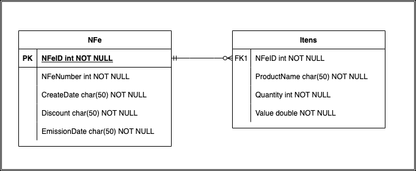

# Trabalhando com arquivos Json(nested)

Deve-se transformar os dados disponíveis em [arquivo Json](https://drive.google.com/file/d/1IDCjpDZh5St97jw4K_bAewJ8hf-rax9C/view?usp=sharing) para o formato de dataframe, algo comum no dia a dia da empresa. Após transformar esse Json em dataframe é possível perceber que a coluna "item_list" está como dicionário. Seu gestor pediu dois pontos de atenção nessa tarefa:
* Expandir a coluna num mesmo dataframe;
* Normalizar os itens dessa coluna de dicionário e dividí-los em dois dataframes separados, seguindo o modelo relacional.

## Recursos 

Somente é fornecido o [arquivo Json](https://drive.google.com/file/d/1IDCjpDZh5St97jw4K_bAewJ8hf-rax9C/view?usp=sharing) para está tarefa

---
# Solução 

A solução se encontra neste [Jupyter notebook](Solucao.ipynb), ao final teremos dois dataframes, resultado da normalização dos dados, os quais respeitam a seguinte relação:

