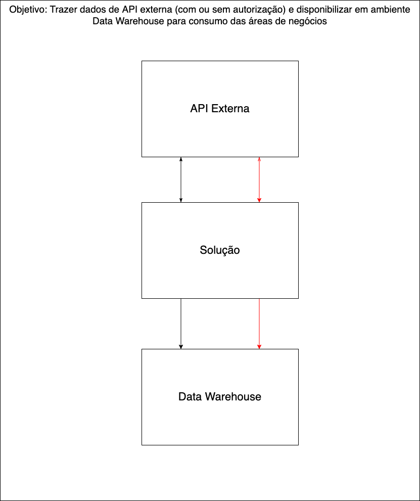
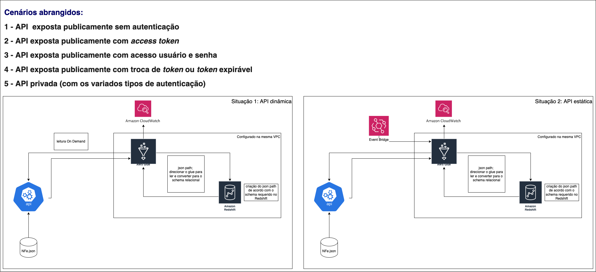

# Solução de ingestão AWS 

A partir da disponibilização via API de dados estruturados em Json, deve se criar uma solução na AWS, ingerir, transformar e, eventualmente, carregar esses dados em um banco de dados RedShift, atendendo aos seguintes pontos:

* Esquema de fluxo de dados
* Descrição de funcionamento (se necessário)
* Nomes de tecnologias em ecossistema AWS (serviço, conectores, bibliotecas e módulos)

## Não há recursos para este entregável
---
# Solução 

A solução exposta foi designada pressupondo alguns cenários em relação ao acesso a API externa e a forma como a API retorna os dados(atualização no  _intraday_).

1 - Desenhou-se o fluxo de dados de forma esquematizada:

2 - A partir de 1, sobre a suite de soluções AWS, obteve-se a seguinte proposta de arquitetura:
 

Sugestões de evolução:

* Entrega de camadas especializadas para os times de negócios. Verificar com os times de negócios quais variáveis e estrutura de dados lhes atendem melhor, para facilidade de manipulação os dados devem estar desaninhados(a solução já deixa os dados em estrutura relacional), visando facilidade na utilzição dos dados pelos times de negócios e auxiliando para que suas entregas sejam tempestivas. 
